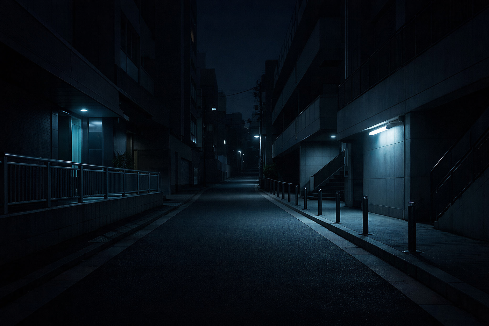

+++
title = 'Quiet Tokyo Night Notes'
date = 2026-03-24T11:00:00+09:00
draft = false
tags = ['journal', 'photography', 'atmosphere']
thumbnail = 'tokyo-night-zone.png'
+++

Some layouts only come into focus when they carry an image. A quiet Tokyo street, a restrained skyline, and a few measured paragraphs are enough to reveal whether the page can hold atmosphere as well as structure.

<!--more-->

This entry exists to show that the theme can move from technical writing to nocturnal visual notes without changing character. The typography stays steady, the image sits naturally in the flow, and the page remains calm even when the scene opens onto a larger city at night.

A good night theme should not merely darken the background. It should make the content feel at home in low light — images softer against the surrounding space, text legible without glare, and the overall atmosphere closer to a reading lamp than a screen.
